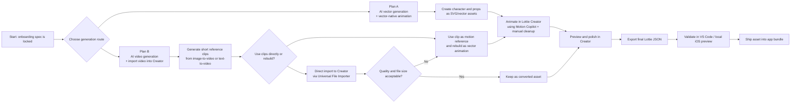

# AI-First Lottie Production Guide

## Goal

This document defines the practical workflow for producing the Part 1 onboarding animations without hiring a dedicated animator.

It compares two viable routes:
- `Plan A`: AI-assisted vector-first production
- `Plan B`: AI video-first production

It also records:
- where the two routes diverge
- where they converge
- which route is recommended for final production
- which Lottie tools, plugins, and MCP-like automation options are actually useful

---

## Executive Summary

### Recommended answer
- Use `Plan A` as the production path
- Use `Plan B` only for motion exploration, fast animatics, or as reference material for rebuilding in `Plan A`

### Why
- `Plan A` is more work, but produces proper vector-native Lottie files
- `Plan B` is faster to ideate, but direct video-to-Lottie conversion usually creates heavier, less editable assets
- For this onboarding, character consistency, small file size, and clean runtime behavior matter more than raw generation speed

### Lowest-cost default
- Start with free tiers and free allowances first
- Spend money only if blocked by export limits or AI credit limits
- Use AI heavily for prompting, prompt refinement, visual exploration, and motion drafting before paying for more generations

### Working documents
- Detailed `Plan B` execution notes live in:
  - `Docs/working/plans/onboarding-plan-b-video-exploration.md`

---

## Flowchart

---

## Divergence And Convergence

### Where they diverge
- `Plan A` starts from vector assets and stays vector-native the whole way
- `Plan B` starts from generated video clips and often becomes raster content wrapped in a Lottie container

### Where they converge
- both routes can converge inside `Lottie Creator`
- both routes can end with exported `Lottie JSON`
- both routes use the same downstream validation and iOS integration steps

### Important caveat
They do **not** converge to the same asset quality profile.

Even if both routes end in `.json`, the underlying asset can still be very different:
- `Plan A` usually gives a lightweight, scalable, editable Lottie
- `Plan B` direct conversion usually gives a heavier, less editable animation that behaves more like embedded raster frames

So the correct mental model is:
- they converge at the **tooling stage**
- they do not always converge at the **asset-quality stage**

---

## Recommended Tool Stack

### Core production tools
- `Lottie Creator` for animation authoring, preview, and export
- `LottieFiles for Figma` only when needed for vector generation or Figma-to-Lottie conversion
- `LottieFiles for VS Code` for local preview and JSON inspection
- `relottie-cli` for optional automation and batch processing

### Upstream AI tools for Plan A
- `LottieFiles Prompt to Vector`
- `Adobe Firefly Text to Vector`
- any LLM for prompt writing, prompt cleanup, and style consistency instructions

### Upstream AI tools for Plan B
- whichever top-tier video model you already have access to
- practical examples today include `Sora`, `Runway`, and `Veo`-class video tools

### Current ecosystem reality
- I did **not** find an official Lottie MCP from LottieFiles
- I did find a community `mcp-server-lottiefiles`, but it only supports searching and fetching LottieFiles animations, not authoring or editing
- the most useful automation primitive today is `relottie-cli`, not MCP

---

## Current Pricing And Limit Snapshot

These are the constraints that matter for keeping cost low.

### Lottie Creator / LottieFiles
- `Lottie Creator` is free to use, but free users can only export `5` animations
- free workspaces can upload up to `5` private files total
- `LottieFiles for Figma` AI Prompt to Vector gives free users `3` generation attempts
- current LottieFiles pricing pages show AI features such as Prompt to Keyframe, Prompt to Vector, and Prompt to State Machines as part of paid AI-inclusive plans
- current support pages say LottieFiles primarily uses annual billing for paid plans

### Runway
- the current free plan includes `125` credits one time
- Runway states that `125` credits equals `25s` of `Gen-4 Turbo`
- paid plans unlock newer or broader model access, including `Gen-4.5`, `Gen-4`, and third-party video models

### Cost implication
- `Plan A` can be tested on free tiers if you are disciplined about exports
- `Plan B` can also be tested cheaply if you keep generations short and use one-time free credits or an existing video subscription
- if you must pay, pay **after** you have already validated your prompts and workflow with free iterations

---

## Plan A: Detailed Execution Manual

This is the recommended production route.

## Phase 0: Lock Inputs Before Spending Any Credits

### What to do
- use the onboarding spec as the only source of truth
- split the work into exactly 4 final assets:
  - `fire_idle.json`
  - `transition_a_to_b.json`
  - `phone_idle.json`
  - `zoom_to_ui.json`
- write one short asset brief per file before generating anything

### Why
- free export limits are tight
- AI vector generations are limited
- the cheapest mistake is the one caught before any tool is opened

### What AI should do here
- use an LLM to rewrite each asset brief into:
  - a visual prompt
  - a motion prompt
  - a negative prompt
  - a consistency checklist

### Output
- 4 short prompt packets, one per asset

---

## Phase 1: Build The Character Bible

### Goal
Create a single master visual identity for the gorilla so all 4 assets feel like the same world.

### What to do
- define the character once, not per scene
- specify:
  - silhouette
  - head shape
  - arm length
  - body proportions
  - line style
  - color palette
  - eye style
  - prop style for fire and phone

### Cheapest workflow
1. Use an LLM to draft 5 to 10 style prompts.
2. Generate rough references with any image model you already have access to.
3. Pick one visual direction.
4. Only then use scarce vector-generation attempts.

### Recommended prompt structure
- subject: `stylized gorilla character`
- style: `flat vector illustration, rounded shapes, minimal details`
- mood: `playful but emotionally clear`
- constraints: `front-facing or slight 3/4 view, centered composition, no text, transparent background`
- consistency: `same character should work with both fire and phone props`

### Output
- one chosen hero reference
- one short written style bible

---

## Phase 2: Generate Vector Assets Cheaply

### Goal
Produce editable vector assets, not final animations yet.

### Lowest-cost recommended order
1. Generate the base gorilla first.
2. Reuse that base to create variants.
3. Generate props separately only if needed.

### Best low-cost sequence
1. Use `LottieFiles Prompt to Vector` or `Adobe Firefly Text to Vector` to create a base gorilla.
2. Export/download as `SVG`.
3. Create two variants from that same base:
   - fire version
   - phone version
4. If the AI output is messy, clean shapes manually in Figma or directly in Creator instead of wasting another generation.

### Important rule
Do **not** spend separate generations on:
- one gorilla for each scene
- one new gorilla for each pose
- every tiny prop variation

Use one mother asset and derive from it.

### AI usage strategy
- use AI for the first 70 percent:
  - silhouette
  - style
  - prop exploration
- use light manual cleanup for the last 30 percent:
  - remove stray points
  - simplify shapes
  - separate limbs and props into layers

### Minimum layer split you want before animation
- head
- torso
- left upper arm
- left lower arm / hand
- right upper arm
- right lower arm / hand
- phone or fire prop
- optional subtle effect layer

### Output
- cleaned `SVG` assets ready for motion

---

## Phase 3: Set Up A Single Master Creator Project

### Goal
Avoid wasting exports and keep all motion in one workspace.

### What to do
- create one `Lottie Creator` project for the entire onboarding Part 1 animation set
- import your cleaned vector assets into that project
- create separate scenes or compositions for:
  - fire idle
  - transition
  - phone idle
  - zoom to UI

### Why
- one workspace keeps style consistent
- one project reduces duplicate cleanup
- internal preview is cheaper than repeated export

### Cost-saving rule
- use Creator preview during production
- export only when an asset is already close to approval

---

## Phase 4: Animate `fire_idle.json`

### Goal
Produce the first clean looping asset.

### What to do
- animate only the smallest motion set needed:
  - arm rhythm
  - shoulder bounce
  - tiny body settle
  - subtle fire response
- keep the loop short and readable

### How AI should help
- ask `Motion Copilot` for the first pass of the repetitive idle motion
- then manually clean:
  - loop seam
  - overly floaty movement
  - inconsistent limb arcs

### Best-practice notes
- do not chase realism
- use exaggerated but simple arcs
- keep the character mass stable
- avoid too many moving parts

### Exit criteria
- the motion reads instantly
- the first and last frames loop cleanly
- the silhouette stays stable at mobile size

---

## Phase 5: Derive `phone_idle.json` From The Same Rig

### Goal
Reuse as much of the `fire_idle` character setup as possible.

### What to do
- duplicate the working character setup
- replace the fire prop with a phone prop
- change the hand and arm rhythm to tapping motion
- keep the body timing simple and obvious

### Why this matters
- reusing the same base character is the cheapest way to maintain consistency
- it also reduces animation bugs across assets

### AI role
- use AI for timing suggestions and motion prompt wording
- do not ask AI to regenerate a whole new character unless the current base is unusable

---

## Phase 6: Build `transition_a_to_b.json`

### Goal
Create the clean handoff between the two idle worlds.

### Cheapest reliable method
- do **not** ask AI to invent a completely new transition style from scratch
- instead, animate with the already approved `fire` and `phone` character variants

### What to do
- put the fire variant on the leftward exit path
- put the phone variant on the rightward entry path
- maintain the same anchor/origin used by the idle assets
- end on the exact stable pose used to start `phone_idle`

### AI role
- use AI only for motion ideas, timing suggestions, or first-pass keyframes
- do final spacing and pose matching manually

### Why
- this asset is the most continuity-sensitive
- direct manual control is cheaper than fixing AI drift later

---

## Phase 7: Build `zoom_to_ui.json`

### Goal
Create the cleanest possible white-frame handoff into Part 2.

### Recommended method
- animate this one manually in Creator, even if you use AI suggestions
- keep the shot very simple:
  - phone centered
  - scale increases
  - screen area dominates
  - frame resolves to pure white

### Why
- this asset does not need complex character acting
- simplicity keeps file size down
- simplicity also makes the handoff easier to implement in SwiftUI

### Optional AI role
- ask AI for timing suggestions only
- avoid overcomplicating the camera move

---

## Phase 8: Export Strategy

### Goal
Stay within free export constraints for as long as possible.

### Recommended strategy
- do not export every iteration
- export only these milestones:
  - first usable `fire_idle`
  - first usable `phone_idle`
  - first usable `transition`
  - first usable `zoom_to_ui`
  - one final corrected re-export if needed

### Why
- free Creator users only get `5` exports
- careless exporting will force an early paid upgrade

### If you hit the export wall
- only then consider paying
- do not pay before prompting, design direction, and motion language are already mostly stable

---

## Phase 9: Validation And Dev Handoff

### What to do
- preview each `.json` in `LottieFiles for VS Code`
- inspect dimensions, fps, and loop behavior
- if needed, use `relottie-cli` for mechanical cleanup or metadata inspection
- test the assets in local iOS playback before calling them final

### Shared acceptance checks
- loop seam is invisible
- no unsupported features break rendering
- file sizes stay within the onboarding spec
- `zoom_to_ui` truly reaches a full white end frame
- reduced motion behavior is defined

---

## Plan A Cost Ladder

### Tier 0: Spend nothing first
- use free Lottie Creator
- use free vector attempts strategically
- use an LLM for prompt writing and prompt cleanup

### Tier 1: Pay only if blocked
- upgrade only when export limits or AI credit limits become the real bottleneck

### Tier 2: Pay for speed, not for discovery
- once direction is stable, paid AI features make more sense
- paying too early usually just buys more bad iterations

---

## Plan B: Simplified Execution Manual

This route is best for quick exploration, animatics, and motion reference.

## Step 1: Choose The Best Video Tool You Already Have

### Good rule
- use the best tool you already subscribe to before opening a new paid subscription

### Practical options today
- `Sora`
- `Runway`
- `Veo`-class tools

### Best mode
- prefer `image-to-video` over pure `text-to-video`

### Why
- image-to-video gives much better character consistency
- it is much easier to keep the same gorilla across multiple clips

---

## Step 2: Generate Only Very Short Clips

### Target
- keep each candidate clip to roughly `1` to `2` seconds

### Constraints
- single subject
- centered framing
- plain background
- no text
- one motion idea per clip

### Why
- shorter clips are cheaper
- shorter clips convert more cleanly
- shorter clips are easier to rebuild later if needed

---

## Step 3: Use One Reference Image Per Character Setup

### What to do
- create one clean gorilla reference image first
- reuse it for:
  - fire idle exploration
  - phone idle exploration
  - transition exploration

### Why
- this is the cheapest way to force consistency in AI video tools

---

## Step 4: Import Into Lottie Creator

### What to do
- import `MP4`, `MOV`, `GIF`, or `WebM` via `Universal File Importer`
- preview the result in Creator

### Immediate decision
- if the imported result is too heavy or too soft, stop using it as a final asset
- keep it as motion reference only

---

## Step 5: Decide Direct-Use Or Rebuild

### Direct-use is acceptable when
- the clip is very short
- file size stays acceptable
- the asset does not need much editability
- visual sharpness is good enough

### Rebuild is preferred when
- the clip contains a main production asset
- the file is heavy
- the subject edges look soft
- loop behavior is poor
- you need precise handoff between scenes

### For this project
- direct-use is most plausible for `zoom_to_ui`
- rebuild is usually preferred for `fire_idle`, `phone_idle`, and `transition_a_to_b`

---

## Best Hybrid Pattern

If you want the highest leverage with the least risk:

1. Use `Plan B` to discover motion.
2. Freeze the best clip as a motion reference.
3. Rebuild that motion in `Plan A`.
4. Export the final production asset from `Plan A`.

This is the highest-confidence workflow for a non-animator.

---

## Shared Downstream Pipeline

Once an asset is accepted for production, the rest of the flow is the same.

1. Put the asset into `Lottie Creator` if it is not already there.
2. Preview and polish timing.
3. Export final `Lottie JSON`.
4. Validate in `VS Code` and local iOS preview.
5. Ship the final `.json` into the app bundle.

---

## Lottie MCP / Plugin / Automation Research

## Official MCP

I did **not** find an official MCP from LottieFiles or Lottie Creator for animation authoring or export automation.

## Community MCP

I found a community project:
- `junmer/mcp-server-lottiefiles`

What it does:
- search LottieFiles animations
- fetch animation details
- retrieve popular animations

What it does **not** do:
- create animations
- edit animations
- export animations
- automate Creator timelines

So it is not a production authoring solution.

## Useful official plugins and tools

### LottieFiles for Figma
- useful for Prompt to Vector
- useful for Figma to Lottie conversion
- not ideal as the primary character-animation tool for this project

### Lottie Creator
- best browser-native authoring environment in this workflow
- the central tool where both Plan A and Plan B can converge

### LottieFiles for VS Code
- useful for previewing `.json` and `.lottie`
- useful for inspecting frame rate and dimensions

### relottie-cli
- best current automation primitive in the Lottie ecosystem
- useful if you later want:
  - linting
  - batch inspection
  - programmatic rewrites
  - a custom in-house Lottie MCP

---

## Final Recommendation

### If you want the highest final quality
- do `Plan A`

### If you want the fastest exploration
- do `Plan B`

### If you want the best overall tradeoff
- do a hybrid:
  - use `Plan B` to discover motion and timing
  - use `Plan A` to build the final production Lottie

For this Love Saving onboarding, the hybrid is the strongest practical choice.

---

## Source Notes

Primary sources used for this guide:

- Lottie Creator FAQ and export limits: [Lottie Creator](https://lottiefiles.com/lottie-creator)
- LottieFiles pricing and AI features: [Pricing](https://lottiefiles.com/pricing) and [AI pricing](https://lottiefiles.com/pricing/ai)
- Free workspace upload limits: [File Upload and Download Limits on Free Workspace](https://help.lottiefiles.com/hc/en-us/articles/16240626895385-Update-on-Upload-Limits-in-Free-Workspace)
- Prompt to Vector free limits in Figma: [AI Prompt to Vector](https://help.lottiefiles.com/hc/en-us/articles/34233365556505-LottieFiles-for-Figma-AI-Prompt-to-Vector)
- Figma to Lottie workflow: [Using Figma to Lottie](https://help.lottiefiles.com/hc/en-us/articles/30798811299865-how-to-use-figma-to-lottie)
- Universal File Importer and supported formats: [Universal File Importer](https://lottiefiles.com/blog/working-with-lottie-animations/universal-file-importer-bring-any-file-into-lottie-creator/)
- Motion Copilot usage: [Introducing Motion Copilot on Lottie Creator](https://lottiefiles.com/blog/working-with-lottie-animations/introducing-motion-copilot-on-lottie-creator)
- Adobe Firefly text-to-vector SVG export: [Generate vectors using text prompts](https://helpx.adobe.com/firefly/generate-vectors/text-to-vector/generate-vectors-using-text-prompts.html)
- Figma AI vectorization and credits: [Convert static images to vector layers](https://help.figma.com/hc/en-us/articles/38031452710807-Convert-static-images-to-vector-layers) and [How AI credits work](https://help.figma.com/hc/en-us/articles/33459875669015-How-AI-credits-work)
- Runway current pricing and model access: [Runway pricing](https://runwayml.com/pricing), [Available Models on Runway](https://help.runwayml.com/hc/en-us/articles/48649877897107-Available-Models-on-Runway), and [Gen-4.5](https://help.runwayml.com/hc/en-us/articles/46974685288467-Creating-with-Gen-4-5)
- Sora current product info: [Sora 2 is here](https://openai.com/index/sora-2/), [Sora app](https://openai.com/sora/), and [Creating videos on the Sora app](https://help.openai.com/en/articles/12460853-creating-videos-on-the-sora-app)
- Lottie iOS and SwiftUI runtime: [airbnb/lottie-ios](https://github.com/airbnb/lottie-ios)
- relottie automation tooling: [relottie-cli](https://developers.lottiefiles.com/docs/tools/relottie/cli/)
- VS Code plugin: [LottieFiles for VS Code](https://lottiefiles.com/plugins/visual-studio-code)
- Community MCP server: [junmer/mcp-server-lottiefiles](https://github.com/junmer/mcp-server-lottiefiles)
