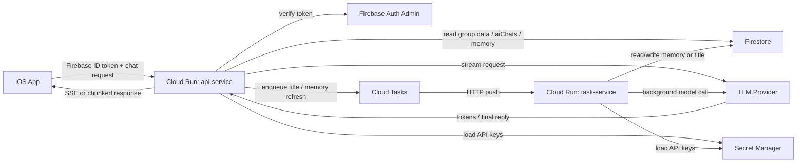
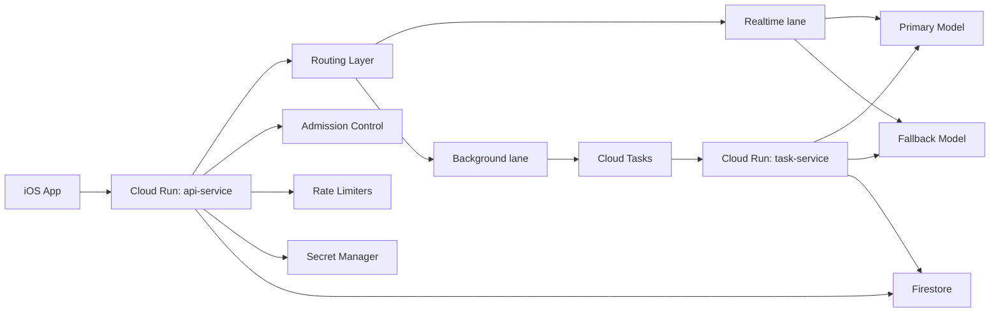
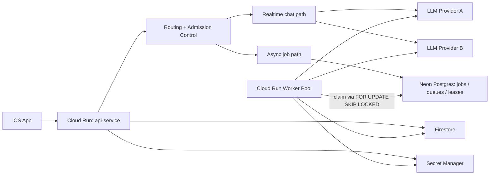

# LoveSaving AI Insights Multi-Phase System Design Plan

Last updated: 2026-03-13

## 1. Document Goal

This document defines the system-design-level plan for `AI Insights`.

The goal is to:
- deliver a ChatGPT-like streaming chatbot experience first
- keep phase-1 cost and operational complexity low
- add enough backend depth to support future system-design storytelling
- preserve a clean upgrade path to `Cloud Run Service + Neon Postgres + Worker Pool`

This is a planning document, not an implementation spec.

## 2. Product Positioning

`AI Insights` is treated as one unified AI feature surface.

Current product direction:
- the main experience is a streaming chatbot inside the `AI Insights` tab
- `weekly summaries` are not a separate report pipeline for now
- instead, weekly summaries are expressed as a chat mode or AI-generated system message backed by recent relationship data

That means the system should optimize for:
- low `Time To First Token (TTFT)`
- low `Time To Last Token (TTLT)`
- stable streaming behavior
- strong backend control over context construction, provider routing, and future async enrichment

It should not optimize first for:
- self-built queue infrastructure
- full adaptive batching
- complex distributed priority scheduling

## 3. Design Principles

### 3.1 Hot path vs cold path

The most important split is:

- `hot path`: user is actively waiting for an answer
- `cold path`: user is not waiting right now

For this product:
- chatbot reply generation is `hot path`
- title generation is `cold path`
- long-term relationship summary refresh is `cold path`
- future maintenance jobs and backfills are `cold path`

### 3.2 Shared data vs private AI artifacts

These are not the same.

Shared relationship data:
- `groups/{groupId}`
- `groups/{groupId}/events/{eventId}`

Private AI artifacts:
- AI chat sessions
- AI chat messages
- user-private derived insight history

The plan assumes AI chat history is private by default, even if the chat uses a shared group as context.

### 3.3 Phase-first system design

The system should evolve in layers:

- Phase 1: correct product behavior with low fixed cost
- Phase 2: harden the inference gateway
- Phase 3: deepen queueing/scheduling infrastructure with `Neon + Worker Pool`

The project should not jump to Phase 3 before Phase 1 is measured in production-like conditions.

## 4. Data Model Direction

### 4.1 Recommended ownership model

Keep shared relationship data in group scope:
- `groups/{groupId}`
- `groups/{groupId}/events/{eventId}`

Store AI chat history in a top-level collection with user ownership:
- `aiChats/{chatId}`
- `aiChats/{chatId}/messages/{messageId}`

Recommended top-level fields on `aiChats/{chatId}`:
- `ownerUid`
- `contextGroupId`
- `visibility = "private"`
- `groupStatusAtCreation`
- `title`
- `createdAt`
- `updatedAt`
- `lastMessageAt`

Why top-level instead of `users/{uid}/aiChats/...`:
- easier collection-wide queries
- easier future analytics and migrations
- easier future async maintenance jobs
- still user-private through security rules and application authorization

### 4.2 Inactive group behavior

For now:
- backend should continue to allow lookup of historical AI chat data tied to inactive groups
- frontend does not need to expose this flow yet

This preserves future product flexibility without complicating the current client.

### 4.3 Weekly summary as a chat capability

Weekly summary should be treated as:
- a chat mode
- or a system-generated message inside an AI chat thread

Recommended context composition:
- recent window: default last `7` days of relevant relationship data
- long-term summary: compact memory document
- current user message

Phase 1 should not expose a user-facing time-window picker.
The system should make the model feel context-aware by default, not like a query builder.

## 5. Phase 1 Architecture

### 5.1 Phase 1 goal

Ship a reliable streaming AI chatbot with clear backend boundaries, low fixed cost, and enough async support for non-blocking derived artifacts.

### 5.2 Phase 1 stack

- `Cloud Run api-service`
- `Cloud Run task-service`
- `Cloud Tasks`
- `Firestore`
- `Firebase Auth ID token verification`
- `Secret Manager`
- one primary model integration
- one secondary model integration behind a stable abstraction, but fallback can stay manual or limited

### 5.3 Phase 1 architecture diagram

### 5.4 Phase 1 request flows

#### A. Chat streaming flow

1. App sends a chat request to `api-service`.
2. `api-service` verifies Firebase ID token and resolves the real user.
3. `api-service` loads:
   - the active chat thread
   - recent relationship data
   - long-term summary if available
4. `api-service` selects the model route.
5. `api-service` calls the provider and streams tokens back to the client immediately.
6. After or alongside streaming completion, `api-service` persists:
   - user message
   - assistant message
   - token usage
   - latency metadata
7. `api-service` optionally enqueues background work:
   - title generation
   - long-term summary refresh

#### B. Long-term summary refresh flow

1. `api-service` or a scheduler decides memory is stale.
2. It creates a Cloud Task.
3. `task-service` receives the task.
4. `task-service` loads recent data and existing summary.
5. `task-service` generates a refreshed compact summary.
6. `task-service` writes the new summary to Firestore.

#### C. Thread title generation flow

1. A new chat starts.
2. `api-service` writes a temporary title based on the first user message.
3. `api-service` creates a Cloud Task.
4. `task-service` later generates a short better title and updates the chat document.

### 5.5 Phase 1 network and access model

#### `api-service`
- internet reachable
- public ingress
- application-layer auth via Firebase ID token

#### `task-service`
- not for end users
- callable only by Cloud Tasks or Cloud Scheduler identities
- internal-only or IAM-restricted access

This keeps the public chat surface simple while isolating background task entrypoints.

### 5.6 Phase 1 context strategy

Each chat request should be built from three layers:

1. `system prompt`
2. `long-term summary`
3. `recent window`, defaulting to the latest `7` days

This gives the user the feeling that the assistant "knows the relationship" without forcing the product to fetch all historical data every time.

### 5.7 Phase 1 feature decisions

Worth doing now:
- streaming response path
- Firebase token verification
- Secret Manager for API keys
- basic multi-modal routing
- background title generation
- background long-term summary refresh
- basic provider timeout and retry policy
- basic rate limiting
- structured observability

Do not do now:
- Postgres queue
- Worker Pool
- adaptive batching
- dynamic priority aging
- complex tenant-tier scheduling
- Redis

### 5.8 Phase 1 trade-offs

Benefits:
- low fixed cost
- fast path stays simple
- async work exists without blocking users
- enough backend depth for a real project story

Costs:
- Firestore remains the metadata store for AI-derived artifacts
- background scheduling is still relatively lightweight
- provider reliability logic is not yet sophisticated
- advanced queue semantics are deferred

## 6. Phase 2 Architecture: Gateway Hardening

### 6.1 Phase 2 goal

Turn the backend from a correct product backend into a more defensible inference gateway.

Phase 2 is about reliability and traffic control, not about adding many user-facing features.

### 6.2 Phase 2 architecture diagram

### 6.3 Phase 2 additions

- provider fallback
- admission control
- better request classification
- lane separation between realtime and background work
- stronger per-user / per-group / per-provider rate limiting
- Retry-After semantics for overload protection
- richer metrics, traces, and error classification

### 6.4 Multi-modal routing direction

Phase 2 should support at least a simple rules-based routing layer:

- text-only request -> text model
- request with image/media -> multimodal model
- low-priority maintenance task -> cheaper or slower model allowed

This should be implemented as routing policy, not as hard-coded model calls scattered through controllers.

### 6.5 Rate limiting direction

Phase 2 rate limiting should exist at three levels:

- `per-user`
- `per-group`
- `per-provider`

Why this matters:
- user fairness
- group abuse protection
- provider quota protection

This is worth doing in Phase 2 because it directly addresses real production failure modes.

### 6.6 API key management direction

API keys should not live in app config, source code, or Firestore documents.

Phase 1 already uses Secret Manager.
Phase 2 should formalize:
- key rotation procedure
- per-provider secret separation
- environment-specific secrets
- auditability of secret access

### 6.7 Why fallback matters

If one provider returns `5xx` or its latency degrades sharply, the system should not collapse with it.

Phase 2 fallback should be conservative:
- only for specific error classes
- only for specific request types
- with explicit telemetry

This is not mainly about cost.
It is about reliability and graceful degradation.

### 6.8 Why batching is still deferred

The project should not implement adaptive batching in Phase 2 unless metrics show a real bottleneck in background task traffic.

Reasons:
- chatbot hot path is latency-sensitive
- requests are heterogeneous
- naive batching easily causes tail latency contamination
- batching only makes sense when there is enough async volume and enough control-plane maturity

## 7. Phase 3 Architecture: Neon Postgres + Worker Pool

### 7.1 Phase 3 goal

Upgrade the system from lightweight async orchestration to a deeper queueing and scheduling design that is worth discussing as a system-design project in interviews.

### 7.2 Phase 3 stack

- `Cloud Run api-service`
- `Neon Postgres`
- `Cloud Run Worker Pool`
- `Firestore`
- optional retained Cloud Tasks for small maintenance tasks

### 7.3 Phase 3 architecture diagram

### 7.4 What changes in Phase 3

Move from:
- Cloud Tasks as the main async execution mechanism

To:
- Postgres-backed queue tables
- pull-based workers
- lease-based job claiming
- explicit priority and starvation control

This is where `FOR UPDATE SKIP LOCKED` becomes relevant.

### 7.5 Why use Neon

Recommended provider: `Neon`

Reasons:
- lighter than jumping straight to Cloud SQL
- suitable for a personal project and staged evolution
- cleaner way to add real Postgres semantics
- branching is useful for experiments and load testing

### 7.6 What Phase 3 should unlock

- stronger async throughput control
- richer queue inspection
- priority queues
- anti-starvation aging
- better background fairness
- clearer separation between realtime and batch workloads
- stronger system-design story for interviews

### 7.7 What Phase 3 is not primarily for

It is not mainly to make the realtime streaming chatbot dramatically faster.

The chat hot path is still dominated by:
- provider latency
- prompt assembly cost
- cold starts

Phase 3 mostly improves:
- background control
- reliability
- queue semantics
- operational explainability

## 8. Feature Prioritization

### 8.1 Do now

- streaming chat
- Firebase token verification
- Firestore-backed AI chat history
- Secret Manager
- title generation via Cloud Tasks
- long-term summary refresh via Cloud Tasks
- basic model routing
- basic timeouts and retries
- structured logging and tracing

### 8.2 Do after the basic product works

- fallback providers
- admission control
- Retry-After behavior
- stronger rate limiting
- request classification
- lane separation by workload type

### 8.3 Do only after metrics justify it

- adaptive batching
- complex dynamic priority scheduling
- Postgres queue ownership
- Worker Pool
- advanced anti-starvation logic

## 9. Metrics and Measurement Plan

### 9.1 Chat metrics

Measure these from Phase 1 onward:

- `TTFT p50 / p95 / p99`
- `TTLT p50 / p95 / p99`
- `context_assembly_ms`
- `provider_latency_ms`
- `stream_failure_rate`
- `cold_start_rate`
- `input_tokens`
- `output_tokens`

### 9.2 Background metrics

Measure these from the first async tasks onward:

- `task_enqueue_to_start_ms`
- `task_processing_ms`
- `task_completion_ms`
- `retry_rate`
- `duplicate_execution_rate`
- `memory_refresh_age`
- `title_generation_lag`

### 9.3 Gateway reliability metrics

- `provider_429_rate`
- `provider_5xx_rate`
- `fallback_activation_rate`
- `admission_reject_rate`
- `retry_storm_signal`
- `background_backlog_depth`

### 9.4 A/B comparison plan for Phase 3

When Phase 3 is implemented, compare:

Baseline:
- `Cloud Tasks + task-service + Firestore state`

Candidate:
- `Neon Postgres + Worker Pool`

Compare under the same synthetic load:
- low load
- medium load
- burst load

Primary comparison dimensions:
- `p95 / p99 enqueue_to_start_ms`
- `p95 / p99 completion_ms`
- background throughput
- duplicate rate
- provider throttle behavior
- operational cost per `1000` async jobs

## 10. Trade-off Summary

### Phase 1 trade-off

Pros:
- fastest path to a real product
- best cost/control balance
- preserves streaming UX quality

Cons:
- not yet a deep queueing system
- limited scheduling sophistication

### Phase 2 trade-off

Pros:
- reliability and traffic-control story becomes much stronger
- system becomes more production-like

Cons:
- more moving parts
- more policy decisions
- more observability work

### Phase 3 trade-off

Pros:
- strongest system-design depth
- more interview-worthy backend story
- better async control plane

Cons:
- highest complexity
- higher operational burden
- not justified unless Phase 1/2 metrics show the need

## 11. Recommended Rollout Order

1. Build `api-service` streaming chat first.
2. Persist AI chat sessions and messages in Firestore.
3. Add `task-service`.
4. Add asynchronous title generation.
5. Add asynchronous long-term summary refresh.
6. Add basic model routing and Secret Manager integration.
7. Add metrics, traces, and provider/error dashboards.
8. Add provider fallback and admission control.
9. Evaluate whether metrics justify moving to `Neon + Worker Pool`.
10. Only then implement Postgres-backed queues and worker-pool scheduling.

## 12. Final Recommendation

The best overall plan is:

- Phase 1: build a strong streaming chatbot with lightweight async enrichment
- Phase 2: harden the inference gateway
- Phase 3: upgrade the background execution model to `Neon Postgres + Worker Pool`

This sequence gives the project:
- a usable product early
- meaningful backend/system-design depth over time
- a credible explanation for every architectural upgrade

That is a stronger story than starting with the most complex stack on day one.
