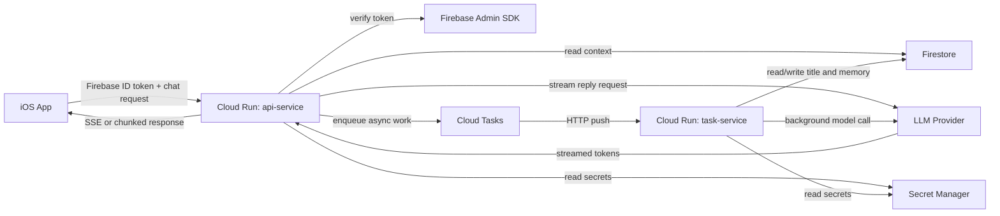

# LoveSaving AI Insights Phase 1 Technical Implementation

Last updated: 2026-03-13

## 1. Document Goal

This document describes the detailed technical implementation for `AI Insights` Phase 1.

It is intended to answer two questions at the same time:

1. What should the Phase 1 backend architecture look like?
2. What do I, as the builder, need to set up in Google Cloud, Firebase, and the repo to make it work?

This document is intentionally more operational than the multi-phase architecture plan. It explains:
- what cloud resources to create
- how they should be configured
- what the Phase 1 backend should do
- what should explicitly wait for later phases

This is still not the final code-level implementation spec. It is the Phase 1 technical blueprint.

## 2. Phase 1 Outcome

Phase 1 should deliver:

- a streaming chatbot experience inside `AI Insights`
- backend-controlled prompt assembly
- Firebase-authenticated access control
- Firestore persistence for AI chat history
- asynchronous title generation
- asynchronous long-term relationship summary refresh
- basic model routing and basic provider protection

Phase 1 should not yet deliver:

- a Postgres-backed job queue
- Cloud Run Worker Pool
- adaptive batching
- complex priority scheduling
- advanced anti-starvation or tenant-tier routing

## 3. Phase 1 Architecture

### 3.1 High-level architecture



### 3.2 Hot path vs cold path

#### Hot path

What the user is actively waiting for:
- chat request
- context assembly
- LLM token streaming
- final message persistence

This path must stay as short as possible.

#### Cold path

What can happen later:
- thread title refinement
- long-term summary refresh
- future maintenance jobs

This path should use Cloud Tasks and should not delay the chat reply.

## 4. Phase 1 Runtime Topology

Phase 1 uses **two Cloud Run services**.

### 4.1 `api-service`

Purpose:
- public entrypoint for the iOS app
- verifies Firebase ID token
- reads Firestore context
- calls the LLM provider
- streams responses back to the client
- enqueues background tasks

### 4.2 `task-service`

Purpose:
- internal background task handler
- receives Cloud Tasks push requests
- refreshes long-term summary
- generates or refines thread titles

### 4.3 Why two services instead of one

Reasons:
- clean network boundary
- public traffic and internal task traffic are separated
- easier to secure `task-service`
- easier to reason about logs, latency, and scaling behavior

Phase 1 still uses one codebase if you want.  
The split is at the deployment and responsibility level, not necessarily at the repository level.

## 5. Google Cloud Resources To Create

This section is written from your perspective as the builder.

### 5.1 Pick the region first

Choose one primary region and keep it consistent across:
- Cloud Run
- Cloud Tasks
- Artifact Registry
- Secret Manager usage
- any future supporting resources

Recommendation:
- choose one region close to your target users
- do not split regions in Phase 1

Important:
- Cloud Tasks setup may prompt you to create an App Engine app
- use the **same region** for that App Engine-backed queue setup and for Cloud Run

Google documents that queue creation can prompt App Engine app creation, and the queue should use the same location as the Cloud Run service.

## 5.2 Enable Google Cloud APIs

You need these APIs enabled:

- Cloud Run Admin API
- Cloud Build API
- Artifact Registry API
- Cloud Tasks API
- Secret Manager API
- IAM Service Account Credentials API
- Service Usage API
- Logging API
- Monitoring API

Optional but recommended:
- Cloud Trace API

## 5.3 Create an Artifact Registry repository

You need a place to store the Spring Boot container image.

Recommended:
- one Docker repository for backend images

Example:
```bash
gcloud artifacts repositories create lovesaving-backend \
  --repository-format=docker \
  --location=REGION \
  --description="LoveSaving backend images"
```

## 5.4 Create service accounts

Create at least these service accounts:

### A. `api-service-sa`

Used by:
- `api-service`

Needs access to:
- read/write Firestore
- access Secret Manager secrets
- create Cloud Tasks tasks

### B. `task-service-sa`

Used by:
- `task-service`

Needs access to:
- read/write Firestore
- access Secret Manager secrets

### C. `cloud-tasks-invoker-sa`

Used by:
- Cloud Tasks when calling `task-service`

Needs access to:
- invoke `task-service`

### D. Optional: `scheduler-invoker-sa`

Only needed if you later add Cloud Scheduler-triggered maintenance endpoints in Phase 1.

## 5.5 Grant IAM roles

At a minimum:

### For `api-service-sa`
- Firestore access appropriate for server-side reads/writes
- Secret Manager Secret Accessor
- Cloud Tasks Enqueuer

### For `task-service-sa`
- Firestore access appropriate for server-side reads/writes
- Secret Manager Secret Accessor

### For `cloud-tasks-invoker-sa`
- `roles/run.invoker` on `task-service`

Google documents that Cloud Tasks can push HTTPS requests to Cloud Run and the service account used for that call needs `roles/run.invoker`.

## 5.6 Create secrets in Secret Manager

Do not put provider API keys in:
- source code
- Firestore
- `.env` committed to git
- iOS app config

Create secrets such as:
- `OPENAI_API_KEY`
- `ANTHROPIC_API_KEY`
- `GEMINI_API_KEY`

You do not need all of them on day one.  
Only create the providers you actually plan to use in Phase 1.

Example:
```bash
printf 'your-secret-value' | gcloud secrets create OPENAI_API_KEY --data-file=-
```

If the secret already exists and you need a new version:
```bash
printf 'your-secret-value' | gcloud secrets versions add OPENAI_API_KEY --data-file=-
```

## 5.7 Create the Cloud Tasks queue

Create at least one queue:

- `ai-insights-default`

Later, if needed, you can split by workload:
- `ai-insights-memory`
- `ai-insights-title`

Start with one queue in Phase 1.

Example:
```bash
gcloud tasks queues create ai-insights-default --location=REGION
```

Google documents that queue creation uses App Engine-backed queue infrastructure and may prompt App Engine app creation. If prompted, create it in the same location as Cloud Run.

## 5.8 Deploy the two Cloud Run services

You need to deploy:

- `api-service`
- `task-service`

Both can point to the same container image if your app uses runtime flags to select its role, or they can use separate entrypoints.  
Either is acceptable in Phase 1.

## 6. Cloud Run Configuration

### 6.1 Recommended Phase 1 settings

#### `api-service`
- scaling: `automatic`
- billing: `request-based`
- `min instances = 0`
- ingress: `all`
- authentication: allow public invoke at the network/IAM layer, enforce Firebase token in app logic
- concurrency: start conservative, not too high
- timeout: enough for streaming replies, but not excessively large

#### `task-service`
- scaling: `automatic`
- billing: `request-based`
- `min instances = 0`
- ingress: `internal`
- authentication: required
- invoker: only Cloud Tasks service account
- timeout: sized for summary/title jobs but within Cloud Tasks timeout

### 6.2 Why `api-service` is public

The iOS app is not a Google service identity.  
It cannot naturally use Cloud Run IAM as the main auth mechanism.

So the correct Phase 1 design is:
- make `api-service` internet reachable
- verify Firebase ID tokens in Spring Boot

### 6.3 Why `task-service` should be internal or tightly restricted

Users should never call background endpoints directly.

`task-service` should only accept traffic from:
- Cloud Tasks
- later, possibly Cloud Scheduler

Google documents that Cloud Tasks in the same project can call a Cloud Run service using the default `run.app` URL and are recognized as internal traffic when the target service uses internal ingress.

### 6.4 Example deployment shape

Example deploy pattern for `api-service`:

```bash
gcloud run deploy api-service \
  --image=REGION-docker.pkg.dev/PROJECT_ID/lovesaving-backend/insights-service:TAG \
  --region=REGION \
  --service-account=api-service-sa@PROJECT_ID.iam.gserviceaccount.com \
  --allow-unauthenticated \
  --ingress=all \
  --min-instances=0 \
  --concurrency=CONCURRENCY_VALUE \
  --timeout=TIMEOUT_SECONDS
```

Example deploy pattern for `task-service`:

```bash
gcloud run deploy task-service \
  --image=REGION-docker.pkg.dev/PROJECT_ID/lovesaving-backend/insights-service:TAG \
  --region=REGION \
  --service-account=task-service-sa@PROJECT_ID.iam.gserviceaccount.com \
  --no-allow-unauthenticated \
  --ingress=internal \
  --min-instances=0 \
  --concurrency=CONCURRENCY_VALUE \
  --timeout=TIMEOUT_SECONDS
```

Then grant invoker only to the Cloud Tasks caller identity for `task-service`.

## 7. Environment Variables and Secrets

### 7.1 Environment variables

Recommended Phase 1 environment variables:

- `SPRING_PROFILES_ACTIVE`
- `APP_ROLE=api` or `APP_ROLE=task`
- `FIREBASE_PROJECT_ID`
- `CLOUD_TASKS_QUEUE_ID`
- `CLOUD_TASKS_LOCATION`
- `TASK_SERVICE_URL`
- `PRIMARY_MODEL_PROVIDER`
- `PRIMARY_TEXT_MODEL`
- `PRIMARY_MULTIMODAL_MODEL`
- `SECONDARY_MODEL_PROVIDER`
- `SECONDARY_TEXT_MODEL`
- `MEMORY_REFRESH_MIN_INTERVAL_HOURS`
- `MEMORY_REFRESH_MIN_NEW_EVENTS`
- `RECENT_CONTEXT_DAYS_DEFAULT`

Google documents Cloud Run environment variable configuration through `--set-env-vars` and config files.

### 7.2 Secret injection

Inject provider keys through Secret Manager.

Example:
```bash
gcloud run deploy api-service \
  --image=IMAGE_URL \
  --update-secrets=OPENAI_API_KEY=OPENAI_API_KEY:latest
```

Do the same for `task-service`.

## 8. Firebase and Firestore Design For Phase 1

### 8.1 Existing shared data

The app already uses:
- `users/{uid}`
- `groups/{groupId}`
- `groups/{groupId}/events/{eventId}`

Phase 1 AI should reuse those as relationship context.

### 8.2 New AI collections

Recommended:

#### `aiChats/{chatId}`

Fields:
- `ownerUid`
- `contextGroupId`
- `visibility`
- `title`
- `titleStatus`
- `groupStatusAtCreation`
- `createdAt`
- `updatedAt`
- `lastMessageAt`

#### `aiChats/{chatId}/messages/{messageId}`

Fields:
- `role`
- `messageType`
- `content`
- `attachments`
- `provider`
- `model`
- `inputTokens`
- `outputTokens`
- `createdAt`
- `requestId`

#### `aiMemories/{memoryId}`

You can either use one top-level memory collection or a deterministic memory document per chat or per `(ownerUid, contextGroupId)` pair.

Fields:
- `ownerUid`
- `contextGroupId`
- `summary`
- `sourceWindowStart`
- `sourceWindowEnd`
- `lastRefreshAt`
- `sourceEventCount`
- `sourceMessageCount`

### 8.3 Why AI chats should be user-private

Even when two users belong to the same group:
- they may ask different questions
- they should not automatically see each other's AI conversations

Therefore:
- AI chat history is private by default
- shared relationship data is only used as context input

### 8.4 Inactive group rule

Phase 1 backend should still allow AI history lookup tied to inactive groups, as long as the authenticated user owns the chat.

Frontend can delay exposing this until later.

## 9. Spring Boot Backend Responsibilities

### 9.1 Suggested repo placement

Recommended path:
- `Backend/insights-service/`

This keeps the backend inside the current monorepo and avoids a second repository too early.

### 9.2 Suggested module boundaries

Suggested components:

#### Public API layer
- `ChatController`
- future read endpoints for chat history

#### Internal task layer
- `TaskController`
- endpoints for title generation and memory refresh callbacks

#### Auth layer
- `FirebaseTokenVerifier`

#### Context layer
- `RelationshipContextService`
- `ChatHistoryService`
- `MemoryService`

#### Provider layer
- `LlmGateway`
- `ProviderRouter`
- `OpenAiClient` / `AnthropicClient` / `GeminiClient`

#### Task layer
- `TaskEnqueueService`
- `TitleGenerationService`
- `MemoryRefreshService`

#### Persistence layer
- `FirestoreChatRepository`
- `FirestoreMemoryRepository`

### 9.3 Why one codebase is still okay

In Phase 1:
- one backend codebase is fine
- two Cloud Run deployments are still recommended

This gives clean runtime separation without creating unnecessary repository overhead.

## 10. API Design

### 10.1 Public chat endpoint

Recommended:
- `POST /api/v1/ai/chats/{chatId}/stream`

Request:
- Firebase ID token in `Authorization`
- user message
- optional attachments
- optional mode metadata

Behavior:
- verify token
- authorize chat ownership and group context
- load recent context + memory
- route to the correct model
- stream reply
- write persistence records
- enqueue background tasks if needed

### 10.2 Internal task endpoints

Recommended:
- `POST /internal/tasks/generate-title`
- `POST /internal/tasks/refresh-memory`

These should:
- require authenticated service-to-service invocation
- never be callable by end users

### 10.3 Why not use Cloud Tasks for chat replies

Phase 1 chat reply generation must stay synchronous from the client perspective.

Putting the chat reply itself into Cloud Tasks would:
- add extra queue delay
- complicate streaming
- hurt chat UX

Cloud Tasks is only for cold-path work in Phase 1.

## 10A. Streaming Transport Model

This section makes the Phase 1 streaming model explicit.

### 10A.1 What "ChatGPT-like streaming" means here

The intended user experience is:
- the user sends one message
- the assistant reply starts appearing incrementally
- the reply is rendered progressively as tokens arrive

This is the familiar "one word at a time" or "one chunk at a time" experience.

From a transport perspective, this means:
- the client opens one HTTP request to `api-service`
- `api-service` keeps that request open
- `api-service` forwards partial response chunks to the client as they arrive from the upstream provider

Phase 1 should implement true streaming, not:
- polling for completion
- waiting for the entire answer and returning once at the end
- background generation followed by a later fetch

### 10A.2 How Phase 1 streaming actually works

Phase 1 does **not** use a worker to generate chat tokens.

Instead:

1. the client sends a chat request to `api-service`
2. `api-service` verifies auth and builds context
3. `api-service` calls the external LLM provider using that provider's streaming API
4. the provider returns incremental token or delta chunks
5. `api-service` immediately forwards those chunks to the client
6. the client appends each chunk to the visible message

So Phase 1 streaming is:

- `provider stream -> api-service -> client`

not:

- `worker -> Redis/WebSocket/gRPC -> api-service -> client`

### 10A.3 Why Redis Pub/Sub is not needed in Phase 1

Redis Pub/Sub or a similar internal relay becomes useful when:
- the API service is not the token producer
- a separate internal worker or GPU service is generating tokens
- the API must keep the user connection open while another internal component emits token updates

That is not the Phase 1 architecture.

In Phase 1:
- the token producer is the external LLM provider
- `api-service` is already the direct consumer of that provider stream
- so `api-service` can forward the stream directly to the client

Because there is no separate internal token-producing worker in the chat hot path, there is no need for:
- Redis Pub/Sub
- internal WebSocket backbone
- internal gRPC token relay
- Pub/Sub-based token fanout

### 10A.4 What Redis-style token relay would solve later

A Redis or message-bus relay would only become relevant if the architecture changes to:

- `client -> api-service`
- `api-service -> internal inference worker`
- internal inference worker generates tokens
- tokens must be pushed back to `api-service`
- `api-service` then streams them to the client

In that design, the system needs an internal real-time bridge between:
- the component holding the client connection
- and the component generating the tokens

Only then do patterns such as these become relevant:
- Redis Pub/Sub
- internal gRPC streaming
- internal WebSocket streams
- a dedicated token event bus

That is a possible future architecture, but it is intentionally out of scope for Phase 1.

### 10A.5 Why Cloud Tasks is not part of chat token streaming

Cloud Tasks is designed for asynchronous push-based background task execution.

It is suitable for:
- title generation
- long-term summary refresh
- maintenance jobs

It is not suitable for the chat token hot path because:
- it adds queue latency
- it complicates true incremental streaming
- it turns a realtime response problem into a job orchestration problem

Phase 1 therefore keeps the chat hot path synchronous and streaming, while only cold-path work uses Cloud Tasks.

### 10A.6 Client-side implication

The client should be designed to consume incremental chunks and progressively render the message body.

The UI should not wait for:
- Firestore persistence
- title generation
- memory refresh

Those happen after or alongside the streamed answer, but they are not part of the visible reply path.

### 10A.7 Phase mapping

This is the intended phase boundary:

- Phase 1:
  - streaming via `provider -> api-service -> client`
  - no Redis
  - no internal token bus
- Phase 2:
  - same transport model, but with stronger provider routing, fallback, and admission control
- Phase 3:
  - still not automatically a Redis system
  - `Neon + Worker Pool` strengthens async task execution, not necessarily token relay

Important:
- `Postgres + Worker Pool` solves queueing and scheduling problems
- `Redis Pub/Sub` solves internal realtime token transport problems

These are different architectural concerns and should not be conflated.

## 11. Multi-Modal Routing In Phase 1

Phase 1 should support **basic routing**, not an elaborate inference mesh.

Recommended rules:
- if request contains media -> send to multimodal-capable model
- if request is text only -> use primary text model
- if provider for the chosen route is unavailable -> surface a controlled failure now, or apply a limited fallback if Phase 1 already supports it

Do not implement:
- adaptive batching
- token-bucket-aware scheduler
- advanced weighted routing

Those belong to later phases.

## 12. Long-Term Relationship Summary

### 12.1 Why it should be async

Long-term memory improves future answers but is not required to answer the current message if a stale summary already exists.

Therefore it should be updated asynchronously.

### 12.2 Refresh policy

Do not refresh on every request.

Recommended Phase 1 policy:
- refresh only if summary is older than a time threshold
- and there has been enough new data since the last refresh

Example policy:
- older than `48 hours`
- and at least `N` new events or messages exist

This avoids wasting provider calls while keeping the summary useful.

### 12.3 Summary source

Summary should be built from:
- recent events
- selected AI chat turns
- previous summary as rolling memory input

Do not use full historical data every time.

## 13. Thread Title Generation

### 13.1 Why it should be async

Thread title is useful for later browsing, but it is not part of the current answer experience.

Making it synchronous would add:
- one more provider call
- more latency
- more failure cases in the hot path

### 13.2 Phase 1 title approach

Use:
- temporary title from first user message
- async refinement through Cloud Tasks

## 14. Basic Provider Protection In Phase 1

### 14.1 Required now

Even in Phase 1, add basic safeguards:

- provider request timeout
- server-side retry with strict limits for safe cases
- bounded Cloud Run max instances if necessary
- conservative concurrency
- basic per-user and per-provider rate limiting

### 14.2 What "basic rate limiting" means in Phase 1

Do not build a full fairness scheduler yet.

Phase 1 only needs:
- protect a single user from spamming
- protect the provider from uncontrolled bursts
- surface overload clearly

This can be implemented simply and later replaced.

## 15. Observability and Metrics

### 15.1 Log every chat request with

- `request_id`
- `uid`
- `chat_id`
- `context_group_id`
- `provider`
- `model`
- `input_tokens`
- `output_tokens`
- `context_assembly_ms`
- `provider_ttft_ms`
- `provider_total_ms`
- `stream_total_ms`
- `cold_start`

### 15.2 Log every async task with

- `task_id`
- `task_type`
- `chat_id`
- `owner_uid`
- `created_at`
- `started_at`
- `finished_at`
- `processing_ms`
- `attempt`
- `result`

### 15.3 Metrics to chart from day one

- `TTFT p50 / p95 / p99`
- `TTLT p50 / p95 / p99`
- `provider_429_rate`
- `provider_5xx_rate`
- `stream_failure_rate`
- `memory_refresh_age`
- `title_generation_lag`

## 16. Local Development Plan

### 16.1 What can run locally

You can run locally:
- Spring Boot backend
- local container build
- local Firebase emulator if useful

You can also develop against real Firebase and local backend during early development.

### 16.2 Suggested local workflow

1. Run Spring Boot locally.
2. Point iOS Simulator to local backend.
3. Use real Firebase Auth / Firestore or emulator as needed.
4. Stub Cloud Tasks locally by calling internal task handlers directly.

Cloud Tasks itself does not need to be fully integrated before the chat path works.

## 17. Deployment Sequence

Recommended order:

1. Create Artifact Registry repository.
2. Create service accounts.
3. Create provider secrets.
4. Deploy `api-service`.
5. Verify Firebase token validation works.
6. Verify streaming chat works end to end.
7. Deploy `task-service`.
8. Create the Cloud Tasks queue.
9. Grant `roles/run.invoker` on `task-service` to the Cloud Tasks caller service account.
10. Enable asynchronous title generation.
11. Enable asynchronous long-term summary refresh.
12. Add monitoring dashboards and alerts.

## 18. Validation Checklist

Before Phase 1 is considered complete, verify:

- iOS app can authenticate and call `api-service`
- invalid Firebase tokens are rejected
- user cannot read or mutate another user's AI chat
- inactive-group historical AI chats remain readable by the owner
- streaming reply works with acceptable latency
- thread title job runs asynchronously
- memory refresh job runs asynchronously
- Cloud Tasks can invoke `task-service`
- `task-service` cannot be called by random external clients
- API keys are loaded from Secret Manager, not hard-coded

## 19. Explicit Phase 1 Deferrals

These are intentionally deferred:

- Postgres
- Worker Pool
- `FOR UPDATE SKIP LOCKED`
- queue fairness algorithms
- adaptive batching
- tenant-aware aging
- complex fallback health scoring

These will belong to the later `Neon + Worker Pool` upgrade path.

## 20. Upgrade Hooks To Preserve Now

Even in Phase 1, keep these design hooks:

- use a provider abstraction layer instead of raw SDK calls everywhere
- use explicit task payload schemas
- use stable message and memory document IDs
- log enough metadata to compare Phase 1 and Phase 3 later
- keep routing decisions explicit and observable

These choices reduce migration cost when the system later upgrades to `Neon Postgres + Worker Pool`.

## 21. Recommended Immediate Next Steps

1. Create `Backend/insights-service/`.
2. Implement `api-service` streaming chat first.
3. Add Firebase ID token verification.
4. Add Firestore-backed AI chat persistence.
5. Deploy `api-service` to Cloud Run.
6. Add `task-service`.
7. Add Cloud Tasks queue and internal invocation.
8. Add title generation.
9. Add long-term summary refresh.
10. Add metrics and dashboards before moving to later phases.

## 22. Reference Links

Primary references used for this document:

- [Deploying container images to Cloud Run](https://docs.cloud.google.com/run/docs/deploying)
- [Executing asynchronous tasks on Cloud Run](https://docs.cloud.google.com/run/docs/triggering/using-tasks)
- [Create HTTP target tasks](https://docs.cloud.google.com/tasks/docs/creating-http-target-tasks)
- [Restrict network endpoint ingress for Cloud Run services](https://docs.cloud.google.com/run/docs/securing/ingress)
- [Access control with IAM for Cloud Run](https://docs.cloud.google.com/run/docs/securing/managing-access)
- [Authenticating service-to-service on Cloud Run](https://docs.cloud.google.com/run/docs/authenticating/service-to-service)
- [Configure environment variables for Cloud Run services](https://docs.cloud.google.com/run/docs/configuring/services/environment-variables)
- [Configure secrets for Cloud Run services](https://docs.cloud.google.com/run/docs/configuring/services/secrets)
- [Create and access a secret using Secret Manager](https://docs.cloud.google.com/secret-manager/docs/create-secret-quickstart)
- [Verify Firebase ID tokens](https://firebase.google.com/docs/auth/admin/verify-id-tokens)
