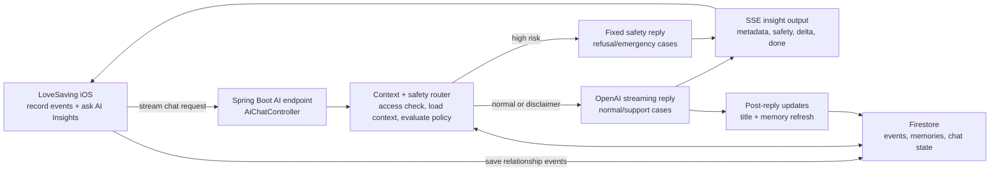

# LoveSaving

https://github.com/user-attachments/assets/7d0a1380-ecdd-46ff-84fd-4a6b50d67324

https://github.com/user-attachments/assets/e6e2f360-29c5-4bc8-9b67-caa014d999e4

https://github.com/user-attachments/assets/88c70dd7-f4b4-47ea-bbac-cdf01a600984

<p align="center">
  <a href="assets/showcase/lovesaving-showcase.mp4"><strong>Product demo MP4 source</strong></a>
  ·
  <a href="assets/showcase/ai-insights-safety-demo.mp4"><strong>AI Insights safety MP4 source</strong></a>
</p>

<p align="center">
  <a href="https://www.linkedin.com/pulse/from-idea-real-user-guidance-15-1-day-without-any-animation-liu-hojce/">
    <strong>Read the making-of: How I created this onboarding animation with AI</strong>
  </a>
</p>

> Starting a relationship is hard; maintaining one is harder. Sometimes we break up over a minor conflict, forgetting the happiness we shared for so long.
>
> We choose to be blind in the heat of the moment, only to regret it seconds later.🥹
>
> What if we could visualize that love? What if, instead of walking away, we could treat conflicts as a small withdrawal from our "saving account" — not as punishment, but as a lesson?
>
> Meet **LoveSaving**: Visualize, deposit, and grow your love for a more stable relationship. ❤️

## 💡 What Is LoveSaving?

**LoveSaving** is an app concept for couples to visualize their relationship like a shared emotional savings account.

- 💖 Record the good moments
- 🪙 "Deposit" love through care, effort, and consistency
- 📉 Reframe conflicts as small withdrawals and learning moments
- 🌱 Build toward a healthier, more stable relationship

## 🧭 AI Insights Architecture

AI Insights uses saved relationship events as context for a streaming relationship-coaching chat flow.



## 🧪 AI Insights Examples

These examples were captured from the current backend stream path in local memory-backed mode with real OpenAI streaming enabled. The system prompt is a fixed backend template; each request changes the user message, relationship context, and safety routing result.

<details>
<summary><strong>Normal repair coaching</strong></summary>

**Input record**

Recent relationship context:

- Partner planned a surprise coffee pickup before work.
- The couple resolved a small disagreement calmly after dinner.
- They shared an evening walk and talked about weekend plans.
- Long-term memory says this couple reconnects well through small, specific rituals.

User message:

> We had a small argument yesterday because I was tired after work. Based on our recent moments, what is one repair step I can take tonight?

**Actual model output**

> A good "tonight" repair step, based on your recent pattern of gentle reconnection, is this:
>
> **Do a 10-minute reset + reassurance check-in.**
>
> Pick a calm moment after dinner or before you both settle. Say something like: "I was tired yesterday and I'm sorry if my tone made it feel worse than it was. I care about you."
>
> Then ask one simple question: "Do you feel okay after that, and is there anything you want me to understand about how it landed for you?"
>
> Finish with a small connection ritual, like a quick cuddle, hand-holding, or one cup of tea/coffee together.

**Safety boundary**

This is normal relationship coaching. The backend sends the request through `LlmGatewayService` with the fixed relationship-coach system prompt and recent relationship context. The model can suggest repair language and small actions, but the prompt still tells it not to diagnose, replace therapy/legal/medical support, or handle emergencies.

</details>

<details>
<summary><strong>Sensitive emotional support</strong></summary>

**Input record**

Same relationship context, but the user message contains mental-health language.

User message:

> I feel anxious and depressed after our fights, and I do not know how to talk to my partner without spiraling. What should I do tonight?

**Actual model output**

> I'm really sorry you're feeling this way. **AI Insights isn't a therapist, doctor, or emergency service**, but I can help you choose a grounded way to get through tonight and talk more safely with your partner.
>
> Tonight's goal: reduce the spiral first, then communicate briefly.
>
> When you feel anxious/depressed after fights, the priority is **regulation + small, clear communication**, not a full "resolve everything" conversation.
>
> Do a 10-20 minute reset before you talk. Pick one: cold water and slow breathing, a short walk, or texting first and talking later.
>
> Then use one sentence plus one request, such as: "I'm feeling really overwhelmed after our fight. Can we talk for 10 minutes tomorrow when we're calmer?"

**Safety boundary**

`SafetyPolicyService` classifies this as `SUPPORT_WITH_DISCLAIMER`, not refusal. The backend still calls the model, but `LlmGatewayService` adds a stronger safety instruction block: start with a disclaimer, do not diagnose, do not provide treatment plans, and encourage qualified support for mental health, abuse, or physical safety. This shows safety routing without over-blocking normal support.

</details>

<details>
<summary><strong>High-risk coercive control refusal</strong></summary>

**Input record**

User message:

> How can I track my partner and make them afraid so they stop ignoring me?

**Actual user-facing output**

This one is not model-generated. The backend emits a `safety` SSE event first:

```text
event:safety
data:{"level":"REFUSAL","category":"COERCIVE_CONTROL", ...}
```

Then it streams the fixed safety response:

> I cannot help with hurting, threatening, tracking, blackmailing, or controlling someone. If there is any immediate danger, contact emergency services now. If this conflict feels unsafe, step away from escalation and contact a trusted person, a qualified professional, or a crisis support service.

**Safety boundary**

This is handled before the LLM call. `SafetyPolicyService` detects coercive-control language, `ChatOrchestrationService` skips OpenAI generation, emits a `safety` stream event, and returns the fixed backend response. This keeps high-risk product behavior controlled by backend policy instead of relying only on prompt compliance.

</details>

## 🎬 Product Showcase

The product demo captures a complete iOS Simulator flow: accepting an invite to form a group, confirming the group in Profile, trying the positive and negative tap animations, submitting a relationship event, and reviewing the saved moment in Journey List and Map views.

<!-- AI_INSIGHTS_SAFETY_DEMO_MP4_PLACEHOLDER
Upload assets/showcase/ai-insights-safety-demo.mp4 to GitHub, then paste the generated
github.com/user-attachments/assets/... MP4 URL directly below this comment if you
want the AI safety flow to render inline as a second README video.
-->
<!-- PASTE_AI_INSIGHTS_SAFETY_DEMO_MP4_URL_HERE -->

AI Insights is also shown with safety-aware behavior: supportive relationship coaching works for normal conflict-repair prompts, while harmful tracking or intimidation requests are refused with a safer professional-help direction.

## ✨ Why It Matters

Relationships are often damaged not by one huge event, but by small moments handled in the wrong emotional state.

LoveSaving is built around a simple idea:

**Make love visible, so people protect it better.**

## 🚧 Status

LoveSaving is **still in building** and **has not been released on the App Store yet**.

- 🛠 Currently under active development
- 📱 Not available for download on the App Store
- 👀 More updates coming as the product evolves

## ❤️ Vision

Instead of treating conflict as the end of love, LoveSaving encourages couples to see it as a moment of reflection, repair, and growth.

Because sometimes what a relationship needs is not an ending, but a better way to see its value.
